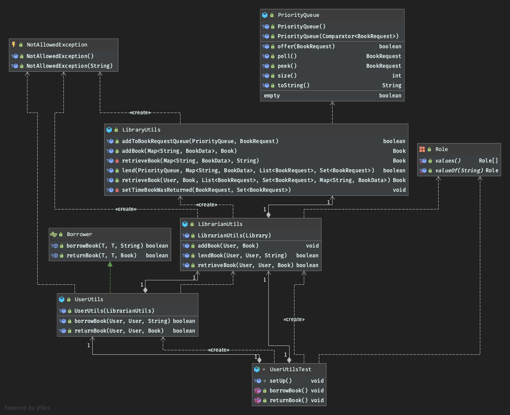

# Library Application Project
A sample application to model a library, where users can borrow
books and return books, through a librarian based on a priority

### Priorities
- A Teacher/Staff (Highest priority)
- A Senior Student (Second highest priority)
- A Junior Student (Lowest priority)

Priority implementaion is based on a custom priority queue
